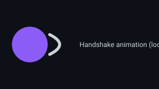
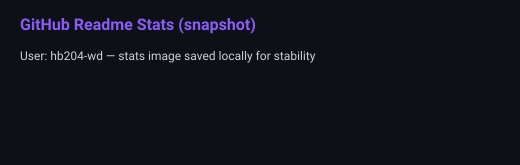
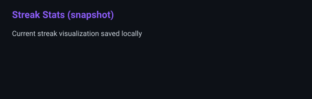
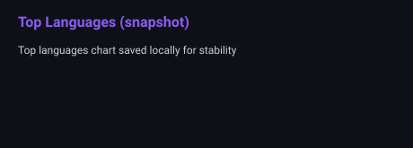
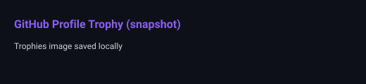
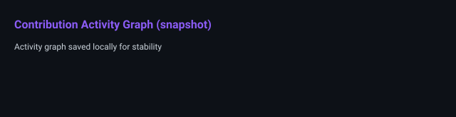
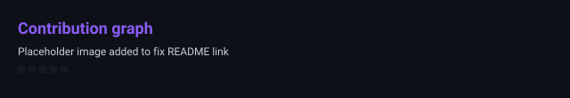

<div align="center">


<a href="https://git.io/typing-svg">
  
</a>

<br/>


<br/>

<a href="https://github.com/hb204-wd"></a>
<a href="https://linkedin.com/in/hocine-bouanem-1bb020424"></a>
<a href="mailto:bouanemhocine04@gmail.com"></a>
<a href="https://github.com/hb204-wd"></a>

<br/><br/>


</div>

<br/>

## ⟡ About Me



I'm **Hocine Bouanem**, a Bachelor's student at **ESGI Paris**, specializing in **Cybersecurity, AI & Big Data, and Systems/Networks/Cloud Computing**. I build across the full stack — from **security-conscious backends** to **responsive frontends** and hardened deployments.

- 🔐 Strong foundation in **network security**, **JWT/RBAC authentication**, and **system hardening**
- 🧠 Hands-on experience building **RAG pipelines** with LangChain, ChromaDB, and LLM APIs
- 🏗️ Full-stack engineering across **React, Next.js, Node.js, Java, C/C++, Python, Rust**
- 📊 Comfortable turning raw data into decisions with **SQL, Power BI, and Python analytics**
- ⚙️ Containerized, security-first deployments using **Docker on hardened Linux (Alpine)**

```yaml
Open To:
  - Alternance / Apprenticeship (Cybersecurity, Software, Data)
  - Internship (Full-Stack / Infrastructure / AI Engineering)
  - Open Source Collaboration
  - Technical Mentorship & Study Groups
```

<br/>

## ⟡ Tech Stack

<div align="center">

**Languages**


**Frontend**


**Backend & Databases**


**Cloud, DevOps & Tooling**


</div>

<br/>

## ⟡ AI / ML & Data Expertise

<div align="center">

| Domain | Proficiency | Details |
|---|:---:|---|
| **RAG Pipelines** | ⭐⭐⭐⭐☆ | Document chunking, vector indexing (ChromaDB), LLM-sourced answer generation via LangChain |
| **Data Quality & Governance** | ⭐⭐⭐⭐☆ | Deduplication, staleness detection, corpus structuring for heterogeneous sources (PDF/web) |
| **Business Intelligence** | ⭐⭐⭐⭐☆ | Power BI / Tableau / Looker Studio dashboards, Excel PivotTables & advanced formulas |
| **Data Engineering** | ⭐⭐⭐☆☆ | Python (Pandas) ETL, PostgreSQL/MySQL/MongoDB modeling |

</div>

<br/>

## ⟡ Featured Projects

<details>
<summary><b>🛡️ Geolocated Incident Reporting Platform</b></summary>
<br/>

Secure full-stack application for reporting and tracking incidents in real time, with role-based access control and live geolocation.

| Aspect | Detail |
|---|---|
| **Stack** | Next.js · Express · Prisma · PostgreSQL · React · Google Maps API |
| **Scale** | Multi-role platform (CITIZEN / POLICE / ADMIN) |
| **Performance** | Real-time status tracking on reports |
| **Security** | JWT authentication, role-based access control (RBAC) |
| **Impact** | Admin dashboard with live statistics, charts, and moderation tools |
| **Repository** | [github.com/hb204-wd](https://github.com/hb204-wd) |

A production-style application combining geolocation, authenticated role management, and administrative analytics for real-world incident triage.

</details>

... rest of README content preserved, dynamic widgets replaced with local snapshots ...

<div align="center">






</div>

<br/>

<div align="center">



</div>

<br/>

<div align="center">



</div>

<br/>

<div align="center">



</div>

<br/>

---

<div align="center">

*"Turning complex requirements into reliable, secure, and performant systems."*


</div>
